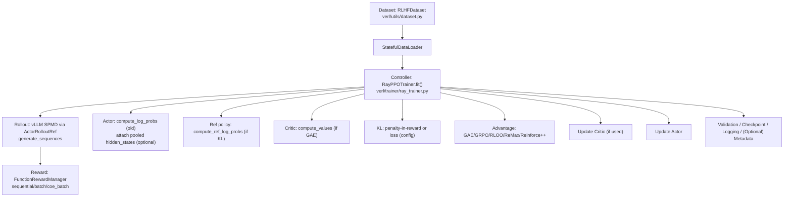

## EasyR1-COE Codebase Overview

Audience: practitioners extending EasyR1 with new models, datasets, and rewards. Focus is on execution flow, critical interfaces, and invariants.

### Architecture at a glance



### End-to-end training flow (critical steps)
1) Data next batch → build `DataProto` with `meta_info` and `uid` per sample.
2) Pop inputs for generation; vLLM generates `responses` (+ masks). Repeat base batch by `rollout.n` and union with generation outputs.
3) If online filtering, precompute rewards to filter, then keep a subset and continue.
4) Seqlen balancing across DP ranks; note this reorders samples (mind group-based estimators like GRPO/RLOO).
5) Asynchronously compute reward (unless already in batch from filtering); recompute `old_log_probs` on actor and attach optional `hidden_states`.
6) If KL enabled, compute `ref_log_probs` and either add KL to reward (penalty) or switch to KL loss.
7) If using GAE, compute `values` with critic.
8) Compute advantages/returns; update critic then actor; periodically validate, log, and checkpoint.

### Configuration system (OmegaConf)
- `verl/trainer/config.py` defines:
  - `DataConfig`: dataset URIs/paths, prompt/answer/image/video keys, jinja `format_prompt`, `max_prompt_length/response_length`, batch sizes, min/max pixels, chat template override.
  - `AlgorithmConfig`: `adv_estimator` (`gae`, `grpo`, `reinforce_plus_plus`, `remax`, `rloo`), KL mode (`disable_kl`, `use_kl_loss`), penalty type (`kl`, `abs`, `mse`, `low_var_kl`, `full`), controller (`fixed`/`adaptive`).
  - `TrainerConfig`: epochs/steps, logging backends, n-nodes/GPUs, validation/save frequency, checkpoint paths; optional metadata saving knobs (CoE additions).
  - `WorkerConfig`: `actor`, `critic`, `ref`, `reward`, `rollout` sub-configs (FSDP/offload, micro/global batch sizes, vLLM sampling, etc.).
- `PPOConfig.post_init` wires data/algorithm into worker fields (e.g., prompt/response lengths, KL settings).
- CLI merges YAML and overrides: `python -m verl.trainer.main config=... key=value ...`.

### Data pipeline
- `RLHFDataset` (`verl/utils/dataset.py`)
  - Loads HF datasets or local files/dirs; supports `data_path@split`.
  - Builds chat `messages` using optional jinja template (`format_prompt`).
  - Vision: uses `processor` to tokenize prompts with images/videos; enforces `min_pixels/max_pixels` and returns proper `position_ids` for VLMs.
  - Returns keys: `input_ids`, `attention_mask`, `position_ids`, `raw_prompt_ids`, `ground_truth`, `multi_modal_data`.
- Collation: `collate_fn` stacks tensors and boxes non-tensors into `np.array(dtype=object)`.
- Dataloaders: `verl/trainer/data_loader.py` creates train/val `StatefulDataLoader` with seeded `RandomSampler` if `shuffle`.

### Controller and workers
- Entry: `verl/trainer/main.py`
  - Parses config; builds tokenizer/processor; selects reward manager; creates dataloaders; instantiates `RayPPOTrainer` and runs `.fit()`.
- Trainer: `verl/trainer/ray_trainer.py`
  - Builds resource pools, spawns colocated FSDP workers (`ActorRolloutRef`, `Critic`, optional `RewardModel`).
  - Enforces divisibility invariants:
    - `data.rollout_batch_size % worker.actor.global_batch_size == 0`
    - `(data.rollout_batch_size * worker.rollout.n) % worker.actor.micro_batch_size_per_device_for_experience == 0`
    - Same for `critic` when GAE.
  - Validates `rollout.n > 1` for `GRPO`/`RLOO`.
  - Seqlen balancing: `_balance_batch` reorders samples for token-balance across DP ranks (mind grouping semantics).
  - Checkpointing: saves `actor` (and `critic` if used), dataloader state, and tracker JSON; supports resume and retention (`save_limit`).

### Algorithms and KL
- `verl/trainer/core_algos.py`
  - Advantage estimators: `GAE`, `GRPO`, `RLOO`, `ReMax`, `Reinforce++`.
  - GRPO outcome variant: per-prompt, z-normalize scalar rewards across `rollout.n` and broadcast across response length; requires `n>1`.
- KL handling:
  - If `use_kl_loss==False`, KL is subtracted from token-level scores as a penalty before advantage.
  - If `use_kl_loss==True`, skip penalty and include KL in the actor loss; KL coef controlled by `Fixed` or `Adaptive` controller.

### Reward system
- `verl/workers/reward/function.py`
  - `SequentialFunctionRewardManager`: Python fn per-sample, sets reward at last token position.
  - `BatchFunctionRewardManager`: batch API for efficiency.
  - `CoEBatchFunctionRewardManager` (COE additions): accepts optional per-sequence `hidden_states` tensor (`[num_layers, hidden_dim]` after pooling); normalizes rewards across rollout candidates per prompt (min–max). Reports `old_overall` (raw) and normalized `overall`.
- Bind a custom reward fn via `worker.reward.reward_function: path.py:fn_name`. Module path is resolved to absolute; fn is imported at runtime.

### Hidden-state extraction (CoE additions)
- During `compute_log_probs`, actor performs forward with `output_hidden_states=True` and caches pooled sequence-level hidden states.
- Trainer tries to fetch and attach `batch["hidden_states"]` after old-log-prob recomputation; then reward manager may consume it (e.g., `coe_batch`).
- Optional metadata saving controlled by `trainer.save_metadata` and related keys:
  - Saves per-step directories with prompt/response texts, rewards, and optional `hidden_states_*.pt`.

### Training loop details (selected)
- Batch assembly: `_make_batch_data` cycles dataloader; builds base batch with `uid` per sample; pops inputs; calls rollout; repeats/interleaves by `rollout.n`; unions outputs; optional filtering; concatenates until reaching `rollout_batch_size * n`.
- Reward: async RPC to reward manager unless pre-computed for filtering; token-level scores placed at last valid token per response.
- Old/ref log-probs and critic values are recomputed on current batch (not using sampled log-probs from rollout).
- Advantage: executed on controller (CPU) to avoid device sync penalties.
- Memory hygiene: optionally deletes `hidden_states` from batch after logging.

### Extending to new models
- Transformers integration under `verl/models/transformers/`:
  - Ensure tokenizer/processor availability and chat template compatibility (or use `data.override_chat_template`).
  - Implement/patch model-specific inputs: vision position IDs, RoPE index (`get_rope_index`), gradient checkpointing toggles, etc.
  - Validate vLLM compatibility for sampling params you need (e.g., `enable_chunked_prefill`, tensor parallel size).
- Actor/Critic configs:
  - Tune `global_batch_size` and micro-batch sizes for update/experience separately; keep divisibility constraints.
  - Memory: FSDP full-shard, CPU offload, `offload_params/optimizer`, and dtype (`worker.actor.fsdp.torch_dtype=bf16` + `optim.strategy=adamw_bf16`).

### Datasets for VLMs
- Provide `image_key`/`video_key`; set `image_dir` when samples reference relative filenames.
- Manage `min_pixels/max_pixels` for token/feature size alignment; adjust `data.max_prompt_length` if mismatch.
- Keep prompts concise; use jinja templates to format multimodal messages consistently.

### Validation, logging, checkpoints
- Validation uses the configured reward manager; logs optional samples (`val_generations_to_log`).
- Loggers: `console`, `wandb`, `mlflow`, `swanlab`, `tensorboard`.
- Checkpoint path defaults to `checkpoints/{project}/{experiment}`; also stores dataloader state and a tracker JSON for resuming/best.
- HF export: `scripts/model_merger.py --local_dir checkpoints/.../actor`.

### Common pitfalls
- GRPO/RLOO: must set `worker.rollout.n > 1`.
- Batch divisibility: respect all invariants or trainer raises.
- VLM dimension mismatch: raise `Image features and image tokens do not match` → increase `data.max_prompt_length` or reduce `data.max_pixels`.
- OOM: lower `worker.rollout.gpu_memory_utilization`; enable `offload_params/optimizer`.
- Seqlen balancing reorders samples; always group by `uid` when doing per-prompt aggregation.
- Remove `deepspeed` from the environment to avoid runtime conflicts.

### Minimal examples
- Launch baseline GRPO (Qwen2.5-VL 7B): see `examples/qwen2_5_vl_7b_geo3k_grpo.sh`.
- Switch to CoE reward + metadata:
```yaml
algorithm:
  adv_estimator: grpo
worker:
  reward:
    reward_type: coe_batch
    reward_function: ./examples/reward_function/training_coe.py:compute_score
trainer:
  save_metadata: true
  metadata_save_hidden_states: true
  metadata_save_freq: 5
```

### Directory map (selected)
- `verl/trainer/`: `main.py` (CLI), `ray_trainer.py` (loop, ckpt, val), `core_algos.py` (advantages), `config.py` (all configs), `data_loader.py`.
- `verl/workers/`: `actor/`, `critic/`, `rollout/` (vLLM), `reward/` (managers), `config.py` (worker wiring).
- `verl/utils/`: `dataset.py`, `tokenizer.py`, `logger/`, `checkpoint/`, `seqlen_balancing.py`, `torch_functional.py`.
- `verl/models/transformers/`: model-specific glue (e.g., `qwen2_vl.py`).
- `examples/`: configs, scripts, reward functions, prompt templates.
- `scripts/`: utilities (e.g., HF merger).
- `tests/`: dataset/ckpt sanity.

### References
- Upstream: [EasyR1 GitHub](https://github.com/hiyouga/EasyR1)
- Multi-node & background docs: [veRL docs](https://verl.readthedocs.io/en/latest/index.html)


